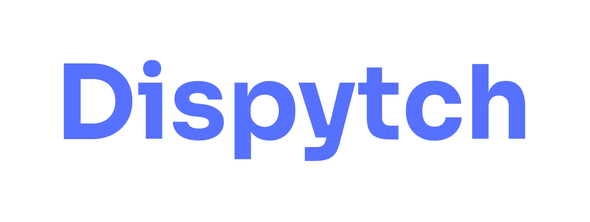

---

**Dispytch** is a lightweight, async Python framework for event-handling.
It’s designed to streamline the development of clean and testable event-driven services.

## 🚀 Highlights

* 🔌 **FastAPI-style dependency injection** – clean, decoupled handlers
* 🧠 **Async core** – built for modern Python I/O
* 📬 **Backend-flexible** – with Kafka, RabbitMQ and Redis PubSub out-of-the-box
* 🧾 **Pydantic-based validation** – event schemas are validated using pydantic
* 🔁 **Built-in retry logic** – configurable, resilient, no boilerplate

---

## 📦 Installation

Install using [uv](https://github.com/astral-sh/uv) with extras for your preferred backend:

for Kafka support:

```bash
uv add dispytch[kafka]
```

For RabbitMQ support:

```bash
uv add dispytch[rabbitmq]
```

For Redis support:

```bash
uv add dispytch[redis]
```

---

## 📚 Documentation

Full documentation is available:  
👉 [here](https://e1-m.github.io/dispytch/)

---

## ✨ Handler example

```python
from typing import Annotated

from pydantic import BaseModel
from dispytch import Event, Dependency, HandlerGroup

from service import UserService, get_user_service


class User(BaseModel):
    id: str
    email: str
    name: str


class UserCreatedEvent(BaseModel):
    user: User
    timestamp: int


user_events = HandlerGroup()


@user_events.handler(topic='user_events', event='user_registered')
async def handle_user_registered(
        event: Event[UserCreatedEvent],
        user_service: Annotated[UserService, Dependency(get_user_service)]
):
    user = event.body.user
    timestamp = event.body.timestamp

    print(f"[User Registered] {user.id} - {user.email} at {timestamp}")

    await user_service.do_smth_with_the_user(event.body.user)

```

---

## ✨ Emitter example

```python

import uuid
from datetime import datetime

from pydantic import BaseModel
from dispytch import EventBase


class User(BaseModel):
    id: str
    email: str
    name: str


class UserEvent(EventBase):
    __topic__ = "user_events"


class UserRegistered(UserEvent):
    __event_type__ = "user_registered"

    user: User
    timestamp: int


async def example_emit(emitter):
    await emitter.emit(
        UserRegistered(
            user=User(
                id=str(uuid.uuid4()),
                email="example@mail.com",
                name="John Doe",
            ),
            timestamp=int(datetime.now().timestamp()),
        )
    )

```

---

💡 See something missing?
Some features aren’t here yet—but with your help, they could be. Contributions welcome via PRs or discussions.

